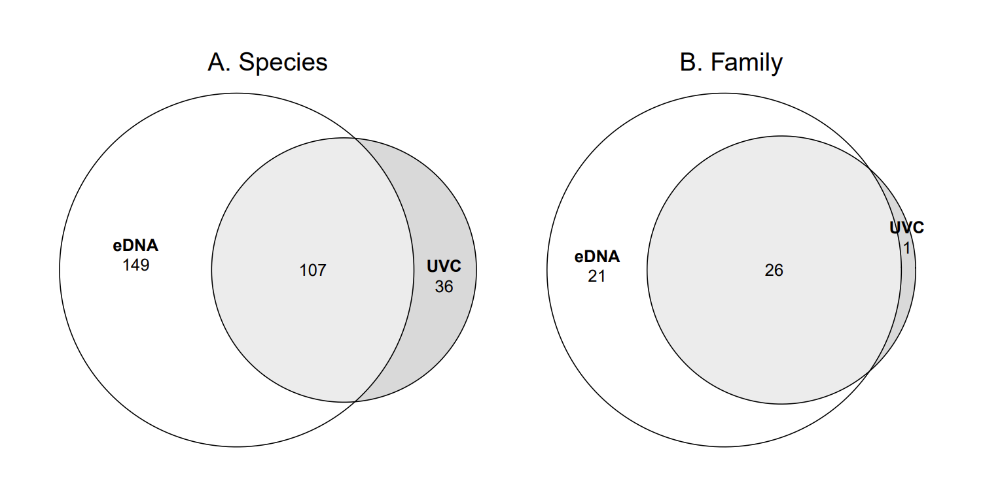

These R scripts reproduce the figures from the paper:
Evaluating the effect of MPAs based on eDNA monitoring and visual census comparison
DOI

Methodological choices and the bioinformatics pipeline are described in:
Optimizing a novel eDNA-based framework for Reef Fish Biodiversity monitoring using an Autonomous Filtration System and in situ Nanopore Sequencing
DOI
https://github.com/LucieCartairade/eDNA_Methodology


## Manage files and set the environment 
```r
set.seed(19980822)

# Libraries always needed
library(ggplot2)
library(dplyr)
library(patchwork)
theme_set(theme_bw())
source("Functions.R")

# Reading metadatas file
metadatas <- read.csv(file = "metadatas.csv", header = T, sep = ";", dec = ",", na.strings = "NA", fileEncoding = "ISO-8859-1")
metadatas$Barcod <- sprintf("%02d",metadatas$Barcod)
metadatas$Run_Barcod <- paste0(metadatas$Run.name,"_barcode",metadatas$Barcod,"_concatenated")

# Reading Correction file to stay update and be consistant between UCV and eDNA results
corr_species <- read.csv2("correction_species_final.csv")
corr_family <- read.csv2("correction_family_final.csv")

# Reading UVC file
VisualCensus <- read.csv2("VisualCensus.csv")

# Reading Decona result file
Res <- read.table("BLAST_out_reclustered_summary_tax_seq_counts.txt",sep ="\t", header = T, na.string = "")
# Removing Homo Sapiens 
Res <- Res[-which(Res$tax.id == "9606"),] 
rownames(Res) <- Res$clusters.id

# Rarefying reads
Tab_raw <- Res[,15:dim(Res)[2]]
raremax <- min(rowSums(t(Tab_raw), na.rm = T)) 
Tab_rar <- vegan::rrarefy(t(Tab_raw), raremax)
Tab_rar <- as.data.frame(t(Tab_rar))
Tab_rar$clusters.id <- row.names(Tab_rar)
Res_rar <- dplyr::right_join(as.data.frame(Res)[,c(1:14)], Tab_rar, by = c("clusters.id" = "clusters.id"))

# Transforming data to merge with metadatas 
Res_melt <- reshape2::melt(Res[,c(1,15:dim(Res)[2])], id = "clusters.id", variable.name = "Run_Barcod", value.name = "Nb.reads")
Res_melt <- Res_melt[Res_melt$Nb.reads != 0,]
Res_melt <- merge(Res_melt,Res[,c(1:(14))], by = "clusters.id", all = T)
Res_melt <- merge(Res_melt, metadatas[,c("Run_Barcod","Sample.ID","Sampling.Site", "Marine.Area","Replica", "Habitat", "Coast")], by = "Run_Barcod", all = T)
# Removing samples that haven't any result
Res_melt <- Res_melt[!is.na(Res_melt$clusters.id),] 
# Creating Taxon column
Res_melt[which(is.na(Res_melt$Family)),c("Family","Genus","Species")] <- "unknown"
Res_melt$Taxon <- ifelse(is.na(Res_melt$Genus), Res_melt$Family,paste(Res_melt$Genus, Res_melt$Species))

# Aggregating to Species level
Tax_melt <- Res_melt_rar %>%
  group_by(tax.id, Sample.ID, Replica, Family, Taxon, Sampling.Site, Marine.Area, Habitat, Coast) %>%
  summarise(
    Nb.reads_sum = sum(Nb.reads),
    X.ID_mean = weighted.mean(X.ID, Nb.reads),
    alignment.length_mean = weighted.mean(alignment.length, Nb.reads),
    mismatches_mean = weighted.mean(mismatches, Nb.reads),
    gap.opens_mean = weighted.mean(gap.opens, Nb.reads),
    evalue_mean = weighted.mean(evalue, Nb.reads),
    bit.score_mean = weighted.mean(bit.score, Nb.reads),
    qcovs_mean = weighted.mean(qcovs, Nb.reads),
    sequence_max = sequence[which.max(Nb.reads)][1]
  ) %>%
  group_by(Sample.ID) %>%
  mutate(
    relative_biomass = 100 * Nb.reads_sum / sum(Nb.reads_sum)
  ) %>%
  ungroup()

Tax_melt[which(Tax_melt$bit.score_mean < 250),"Taxon"] <- "unknown"
Tax_melt[which(Tax_melt$bit.score_mean < 250),"Family"] <- "unknown"
Tax_melt[which(Tax_melt$bit.score_mean < 250),"X.ID_mean"] <- NA

# Correcting some species and family names
Tax_melt <- Tax_melt %>%
  left_join(corr_species, by = c("Taxon" = "original_species")) %>%
  mutate(Taxon = coalesce(corrected_species, Taxon)) %>%
  select(-corrected_species) %>%
  left_join(corr_family, by = c("Taxon" = "species")) %>%
  mutate(Family = coalesce(corrected_family, Family)) %>%
  select(-corrected_family)

# Assigning unknown to bitscore < 250 
Tax_melt$Sample.Type <- "eDNA"
Tax_melt$Sample.ID <- paste(Tax_melt$Sample.Type, Tax_melt$Marine.Area, Tax_melt$Sampling.Site, Tax_melt$Habitat, Tax_melt$Replica)
Tax_table <- reshape2::acast(Tax_melt, value.var = "Nb.reads_sum", Taxon~Sample.ID, fill = 0, fun.aggregate = sum)

# Joining eDNA table with UVC Table
Tax_melt_wVC <- dplyr::full_join(Tax_melt, VisualCensus,
                                 by = c("Taxon" = "Species",
                                        "Replica" = "Transect", 
                                        "relative_biomass" = "relative_biomass",
                                        "Nb.reads_sum" = "Abundance_sum",
                                        "Sampling.Site" = "Marine Area", 
                                        "Sample.Type" = "Sample.Type", 
                                        "Marine.Area" = "Marine.Area", 
                                        "Habitat" = "Habitat", 
                                        "Family" = "FAMILY", 
                                        "Coast" = "Coast"))

Tax_melt_wVC$Sample.ID <- paste(Tax_melt_wVC$Sample.Type, Tax_melt_wVC$Marine.Area, Tax_melt_wVC$Sampling.Site, Tax_melt_wVC$Habitat, Tax_melt_wVC$Replica)
Tax_melt_wVC <- Tax_melt_wVC[,c("Sample.ID", "Marine.Area","Sampling.Site", "Coast" ,"Habitat","Replica", "Sample.Type", "Family", "Taxon" , "Nb.reads_sum", "relative_biomass")]

# Shaping into table 
Tax_table_wVC <- reshape2::acast(Tax_melt_wVC, value.var = "relative_biomass", Taxon~Sample.ID, fill = 0, fun.aggregate = sum)
```

##  Generating Figures from the paper
### Figure 1: Map of Moorea showing the Marine Protected Area (MPAs) and sampling locations
<p align="center">
  
</p>

Shapes files available at : https://www.tefenua.data.gov.pf
and : https://www.tefenua.data.gov.pf/datasets/ef2bdc8e55f049318a3888f8134349b0_0/explore?location=-17.535984%2C-149.840113%2C11.48
```r
library(sf)

### Reads Files
my_sf <- read_sf(paste0(Datas_path,"Moorea/WGS84_TraitDeCote.shp"), options = "ENCODING=UTF-8")
sf_Moorea <- my_sf %>% filter(ILE == "MOOREA")

sf_Moorea <- sf_Moorea %>%
  mutate(Carto = recode(Carto,
                        "Terre"   = "Land",
                        "Récif"   = "Reef",
                        "Lagon"   = "Lagoon",
                        "Tombant" = "Outer reef"
  ))

sf_Moorea$Carto <- factor(sf_Moorea$Carto, levels = c("Land", "Reef", "Lagoon", "Outer reef"))

sf_AMP <- read_sf(paste0(Datas_path,"PGEM_AMP/PGEM_Aires_marines_prot%C3%A9g%C3%A9es_(TeFenua).shp"))

st_crs(sf_AMP)
st_crs(sf_Moorea)

### Color palettes
palette <- c(
  Land = "gray80",
  Reef = "lightblue",
  Lagoon = "turquoise",
  `Outer reef` = "skyblue", 
  `Marine Protected Area` ="red"
)
palette2 <- c(
  Control = "blue", 
  MPA = "black"
)

### Coordinates
coord <- read.csv(file = "MPA_GPS-points.csv", header = T, sep = ";", dec = ",", na.strings = "NA", fileEncoding = "ISO-8859-1")
coord <- as.data.frame(coord)
coord <- coord %>% filter(Nom.de.l.Aire.Marine == "AHI" | Nom.de.l.Aire.Marine == "AFAREAITU"  | Nom.de.l.Aire.Marine == "ENTRE 2 BAIES"  | 
                            Nom.de.l.Aire.Marine == "HAAPITI" | Nom.de.l.Aire.Marine == "PIHAENA"  | Nom.de.l.Aire.Marine == "TAOTAHA" )
coord$Latitude <-paste0("-",coord$Latitude)
coord$Longitude <-paste0("-",coord$Longitude)
coord$Type.d.Aire.Marine <- recode(coord$Type.d.Aire.Marine, "AMT" = "Control", "AMP" = "MPA")
coord <- coord[!is.na(coord$Nom),]

coord$Latitude_d <- parzer::parse_lat(coord$Latitude)
coord$Longitude_d <- parzer::parse_lon(coord$Longitude)

coord <- st_as_sf(coord, coords = c("Longitude_d", "Latitude_d"),  crs = 4326)

#### Map
ggplot() +
  geom_sf(data = sf_Moorea, aes(fill = Carto), color = "black") +  
  scale_fill_manual(values = palette, name = "Zones") + 
  geom_sf(data = sf_AMP, aes(fill = "Marine Protected Area"), alpha = 0.4) +
  geom_sf(data = coord, aes(color = Type.d.Aire.Marine), size = 3, shape = 18) + 
  scale_color_manual(values = palette2, name = "Status") + 
  theme_minimal() + 
  scale_x_continuous(
    #name = "Longitude",
    labels = "149°50′W",
    breaks = -149.83333
  ) +
  scale_y_continuous(
    #name = "Latitude",
    labels = "17°32′S",
    breaks = -17.5333312
  ) + ggspatial::annotation_scale(location = 'tl')

ggsave(path = Images_path, file = "Figure1.pdf", height = 7, width = 7)  
```
### Figure 2: Venn diagram
<p align="center">
  
</p>

```r
pdf(file = paste0(Images_path, "Figure2.pdf"), width = 10, height = 5)
set.seed(10)

Tab_Euler_1 <- reshape2::acast(subset(Tax_melt_wVC, Sampling.Site != "Control" & Replica != "B" & Family != "unknown"), value.var = "relative_biomass", Taxon ~ Sample.Type, fill = 0, fun.aggregate = sum)
Tab_Euler_1 <- ifelse(Tab_Euler_1 == 0, FALSE, TRUE)
p1 <- plot(eulerr::euler(Tab_Euler_1, shape = "ellipse"), quantities = TRUE, main = "A. Species", return_grob = TRUE)

Tab_Euler_2 <- reshape2::acast(subset(Tax_melt_wVC, Sampling.Site != "Control" & Replica != "B" & Family != "unknown"), value.var = "relative_biomass", Family ~ Sample.Type, fill = 0, fun.aggregate = sum)
Tab_Euler_2 <- ifelse(Tab_Euler_2 == 0, FALSE, TRUE)
p2 <- plot(eulerr::euler(Tab_Euler_2, shape = "ellipse"), quantities = TRUE, main = "B. Family", return_grob = TRUE)

gridExtra::grid.arrange(p1, p2, ncol = 2, padding = unit(1, "cm"), top = grid::textGrob(""), bottom = grid::textGrob(""), left = grid::textGrob(""), right = grid::textGrob(""))

dev.off()
```
### Figure 3: Species count per Family
<p align="center">
  
</p>

```r
# Count number of species (Taxon) per Family and Sample.Type
df_count <- Tax_melt_wVC %>%
  filter(!is.na(Family), !is.na(Taxon), Taxon != "unknown") %>%
  distinct(Sample.Type, Family, Taxon) %>%
  group_by(Sample.Type, Family) %>%
  summarise(count = n(), .groups = "drop")

# Define order of families: first by total species count, second by presence in both methods
family_order <- df_count %>%
  group_by(Family) %>%
  summarise(
    sum_count = sum(count, na.rm = TRUE),
    both_methods = as.integer(n_distinct(Sample.Type[count > 0]) == 2),
    .groups = "drop"
  ) %>%
  arrange(sum_count, desc(both_methods)) %>%  
  pull(Family)

# Complete the dataset with missing combinations Family x Sample.Type,
# fill with zeros, and prepare mirrored values for plotting
df_count <- df_count %>%
  tidyr::complete(Sample.Type, Family, fill = list(count = 0)) %>%
  mutate(Family = factor(Family, levels = family_order),
         Sample.Type = factor(Sample.Type, levels = c("eDNA", "UVC")),
         count_plot = ifelse(Sample.Type == "eDNA", count, count)) 

# Build mirrored barplot: negative values for eDNA, positive for UVC
p1 <- ggplot(df_count, aes(x = Family, y = count_plot, fill = Sample.Type)) +
  geom_bar(stat = "identity", position = position.dodge(), width = 0.5) +
  scale_fill_manual(values = c("eDNA"= "#8f226e", "UVC" = "#f18055")) +
  scale_y_continuous(labels = abs) +
  labs(x = "Family", y = "Species count", fill = "Method") +
  coord_flip() +
  theme(
    axis.text.y = element_text(size = 10),
    axis.text.x = element_text(size = 10),
    axis.title = element_text(size = 12),
    legend.position = "top",
    legend.title = element_text(size = 11),
    legend.text = element_text(size = 10),
    panel.border = element_rect(color = "black", fill = NA, linewidth = 0.4)
  )
p1

ggsave(path = Images_path, file = "Figure3.pdf", width = 6.5, height = 5)
```
### Figure 4: Community composition overview per Family
<p align="center">
  
</p>

```r
library(dplyr)
library(ggplot2)
library(RColorBrewer)
library(tidyr)

df_plot <- Tax_melt_wVC %>%
  filter(!is.na(Family), Family != "unknown",
         !is.na(relative_biomass), !is.na(Taxon)) %>%
  group_by(Sample.Type, Family, Taxon) %>%
  summarise(reads = sum(Nb.reads_sum), .groups = "drop") %>%
  group_by(Sample.Type) %>%
  mutate(prop = 100 * reads / sum(reads)) %>%
  ungroup()

# Order of families (most abundant on top)
family_order <- df_plot %>%
  group_by(Family) %>%
  summarise(sum_prop = sum(prop, na.rm = TRUE), .groups = "drop") %>%
  arrange(desc(sum_prop)) %>%
  pull(Family)

# Complete missing combinations and create factors
df_plot <- df_plot %>%
  complete(Family, Sample.Type, Taxon, fill = list(reads = 0, prop = 0)) %>%
  mutate(
    Family = factor(Family, levels = family_order),
    Sample.Type = factor(Sample.Type, levels = c("eDNA", "UVC")),
    Family_Method = factor(
      paste(Family, Sample.Type, sep = "_"),
      levels = unlist(lapply(rev(family_order),
                             function(f) c(paste0(f, "_eDNA"), paste0(f, "_UVC"))))
    )
  )

# Selection of the 20 most abundant taxa
taxon_stats <- df_plot %>%
  group_by(Taxon) %>%
  summarise(total_prop = sum(prop, na.rm = TRUE), .groups = "drop") %>%
  arrange(desc(total_prop))

top_taxa <- head(taxon_stats$Taxon, 20)

# Replacement + stacking order
taxon_order <- c(top_taxa, setdiff(taxon_stats$Taxon, top_taxa), "Other")

df_plot <- df_plot %>%
  mutate(
    Taxon = ifelse(Taxon %in% top_taxa, Taxon, "Other"),
    Taxon = factor(Taxon, levels = rev(unique(c(top_taxa, "Other"))))
  )

getPalette <- colorRampPalette(RColorBrewer::brewer.pal(12, "Paired"))
main_colors <- getPalette(length(top_taxa))
speciesPalette <- c(setNames(main_colors, top_taxa), "Other" = "black")


p <- ggplot(df_plot, aes(x = Sample.Type, y = prop, fill = Taxon)) +
  geom_bar(stat = "identity", width = 0.8) +
  scale_fill_manual(values = speciesPalette) +
  labs(
    x = "Family by Method",
    y = "Relative biomass estimation (%)",
    fill = "Taxon"
  ) +
  coord_flip() +
  facet_grid(rows = vars(Family), scales = "free_y", space = "free_y", switch = "y") +
  theme_minimal() +
  theme(
    strip.placement = "outside",
    strip.text.y.left = element_text(angle = 0, hjust = 1, size = 9),
    axis.text.y = element_text(size = 7),
    axis.text.x = element_text(size = 10),
    axis.title  = element_text(size = 12),
    legend.title = element_text(size = 11),
    legend.text = element_text(size = 10),
    legend.position = "right",
    panel.spacing = unit(0.05, "lines")
  ) +
  guides(fill = guide_legend(ncol = 1))

p

ggsave(path = Images_path, file = "Figure4.pdf", width = 10, height = 12)
```
### Community structure
Data initialisation 
```r
sample <- Tax_melt_wVC %>% 
  select(Sample.Type, Marine.Area, Sampling.Site, Habitat, Replica, Coast) %>% 
  group_by(Sample.Type, Marine.Area, Sampling.Site, Habitat, Replica, Coast) %>%
  summarise()
sample <- as.data.frame(sample)
rownames(sample) <- paste(sample$Sample.Type, sample$Marine.Area, sample$Sampling.Site, sample$Habitat, sample$Replica)

Tax_table <- reshape2::acast(subset(Tax_melt_wVC, Sampling.Site != "Control" & Replica != "B" & Family != "unknown"), 
                                 value.var = "relative_biomass", Taxon~Sample.ID, fill = 0, fun.aggregate = sum)

Tax_table_eDNA <- reshape2::acast(subset(Tax_melt_wVC, Sampling.Site != "Control" & Replica != "B" & Sample.Type == "eDNA" & Family != "unknown"), 
                                 value.var = "relative_biomass", Taxon~Sample.ID, fill = 0, fun.aggregate = sum)

Tax_table_VC <- reshape2::acast(subset(Tax_melt_wVC, Sampling.Site != "Control" & Replica != "B" & Sample.Type == "UVC" & Family != "unknown"), 
                                  value.var = "relative_biomass", Taxon~Sample.ID, fill = 0, fun.aggregate = sum)

```
Jaccard and BrayCurtis distance matrices
```r
# Jaccard and Bray Curtis on both Sample.Type
dist.jc.both <- betapart::beta.pair(t(ifelse(Tax_table != 0 , 1, 0)), index.family="jaccard")
dist.bc.both <- vegan::vegdist(t(Tax_table), method = "bray")

# Jaccard and Bray Curtis on eDNA
dist.jc.eDNA <- betapart::beta.pair(t(ifelse(Tax_table_eDNA != 0 , 1, 0)), index.family="jaccard")
dist.bc.eDNA <- vegan::vegdist(t(Tax_table_eDNA), method = "bray")

# Jaccard and Bray Curtis on VC
dist.jc.VC <- betapart::beta.pair(t(ifelse(Tax_table_VC != 0 , 1, 0)), index.family="jaccard")
dist.bc.VC <- vegan::vegdist(t(Tax_table_VC), method = "bray")

# Heatmap of matrix of distance
my_pheatmap <- function(dist, name, h, w)
{
  my_plot <- pheatmap::pheatmap(as.matrix(dist), cluster_rows = F, cluster_cols = F, cellwidth = 9, cellheight = 9)
  my_plot
  ggsave(path = paste0(Images_path, "Dissimilarity Matrix/"), file = name, plot = my_plot, height = h, width = w )
}
my_pheatmap(dist = dist.jc.both$beta.jac, name = "Both_Jaccard.svg", h = 20, w = 20 )
my_pheatmap(dist = dist.bc.both, name = "Both_BrayCurtis.svg", h = 20, w = 20 )
```
PERMANOVA analyses on each method
```r 
my_Permanova <- function(dist, sample_dist)
{
  set.seed(19980822)
  vegan::adonis2(
    dist ~ Marine.Area + Sampling.Site + Sampling.Site:Habitat,
    data = sample_dist, 
    permutations = 10000, 
    strata = sample_dist$Habitat)
}
my_Permanova(dist = dist.jc.eDNA$beta.jac, sample_dist = subset(sample, Sampling.Site != "Control" & Replica != "B" & Sample.Type == "eDNA"))
my_Permanova(dist = dist.jc.VC$beta.jac, sample_dist = subset(sample, Sampling.Site != "Control" & Replica != "B" & Sample.Type == "UVC"))

my_Permanova(dist = dist.bc.eDNA, sample_dist = subset(sample, Sampling.Site != "Control" & Replica != "B" & Sample.Type == "eDNA"))
my_Permanova(dist = dist.bc.VC, sample_dist = subset(sample, Sampling.Site != "Control" & Replica != "B" & Sample.Type == "UVC"))
```
PERMANOVA analyses on both methods
```r
my_Permanova <- function(dist, sample_dist)
{
  set.seed(19980822)
  vegan::adonis2(
    dist ~ Sample.Type + Marine.Area + Sampling.Site + Sampling.Site:Habitat,
    data = sample_dist, 
    permutations = 99999, 
    strata = sample_dist$Habitat
    )
}
my_Permanova(dist = dist.jc.both$beta.jac, sample_dist = subset(sample, Sampling.Site != "Control" & Replica != "B"))
my_Permanova(dist = dist.bc.both, sample_dist = subset(sample, Sampling.Site != "Control" & Replica != "B" ))
```
### Figure 5 and 6 : Constrained Analysis of Principal Coordinates (CAP)
Jaccard distance CAP
<p align="center">
  
</p>

Bray-Curtis distance CAP 
<p align="center">
  
</p>

```r
my_CAP <- function(dist, n_arrows) {
  cap <- vegan::capscale(dist  ~ Sample.Type + Marine.Area + Sampling.Site + Sampling.Site:Habitat,
                         data = subset(sample, Sampling.Site != "Control" & Replica != "B"))
  cap
  summary(cap)
  anova(cap, permutations = 999, by = "terms")
  
  ef <- vegan::envfit(cap, vegan::decostand(t(Tax_table), method = "hellinger"), perm = 999)
  
  eig <- cap$CCA$eig
  eig_perc <- eig / sum(eig) * 100
  eig_perc[1:2]
  
  vec <- ef$vectors$arrows
  pvals <- ef$vectors$pvals
  
  vec_scaled <- vec * sqrt(ef$vectors$r)
  arrow_lengths <- sqrt(rowSums(vec_scaled^2))
  
  pvals <- pvals[pvals < 0.05]
  arrow_lengths <- arrow_lengths[names(arrow_lengths) %in% names(pvals)]
  top_idx <- names(sort(arrow_lengths, decreasing = TRUE))[1:15]
  
  ef_subset <- ef
  ef_subset$vectors$arrows <- ef$vectors$arrows[top_idx, , drop = FALSE]
  ef_subset$vectors$r <- ef$vectors$r[top_idx]
  ef_subset$vectors$pvals <- ef$vectors$pvals[top_idx]
  
  site_df <- as.data.frame(vegan::scores(cap, display = "sites"))
  site_df <- merge(site_df, subset(sample, Sampling.Site != "Control" & Replica != "B"), by = "row.names")
  rownames(site_df) <- site_df$Row.names; site_df$Row.names <- NULL
  
  arrows <- as.data.frame(ef$vectors$arrows)
  arrows$species <- rownames(arrows)
  arrows$length <- ef$vectors$r
  arrows$pval <- ef$vectors$pvals
  
  arrows <- subset(arrows, pval < 0.05)
  arrows <- arrows[order(arrows$length, decreasing = TRUE),]
  arrows_select <- arrows[1:n_arrows,]
  
  
  p <- ggplot(site_df, aes(x = CAP1, y = CAP2)) +
    stat_ellipse(aes(color = Sample.Type),
                 type = "norm", level = 0.97, size = 0.75) + 
    scale_color_viridis_d(option = "magma", begin = 0.45, end = 0.75) +
    ggnewscale::new_scale_color() +
    geom_point(aes(color = Habitat, shape = Marine.Area), size = 2)  + 
    scale_color_viridis_d(option = "viridis", begin = 0.4) +
    geom_segment(data = arrows_select, aes(x = 0, y = 0, xend = CAP1, yend = CAP2), 
                 arrow = arrow(length = unit(0.2, "cm")), color = "gray", linewidth = 0.5) +
    ggrepel::geom_text_repel(data = arrows_select,
                             aes(x = CAP1 * 1.1, y = CAP2 * 1.1, 
                                 label = paste0("italic('", species, "')")), 
                             color = "gray50", size = 3, 
                             max.overlaps = 1000, segment.color = NA,
                             parse = TRUE) + 
    scale_linetype_manual(values = c(3, 2, 1)) + 
    guides(shape = guide_legend(order = 1)) + 
    labs(
      x = paste0("CAP1 (", round(eig_perc[1], 1), "%)"),
      y = paste0("CAP2 (", round(eig_perc[2], 1), "%)")
    )

  return(p)
}

pJ15 <- my_CAP(dist = dist.jc.both$beta.jac, n_arrows = 15)
pj15
ggsave(path = paste0(Images_path, "CAP/"), file = "Figure5.pdf", height = 6, width = 7 )

pBC15 <- my_CAP(dist = dist.bc.both, n_arrows = 15)
pBC15
ggsave(path = paste0(Images_path, "CAP/"), file = "Figure6.pdf", height = 6, width = 7 )
```
